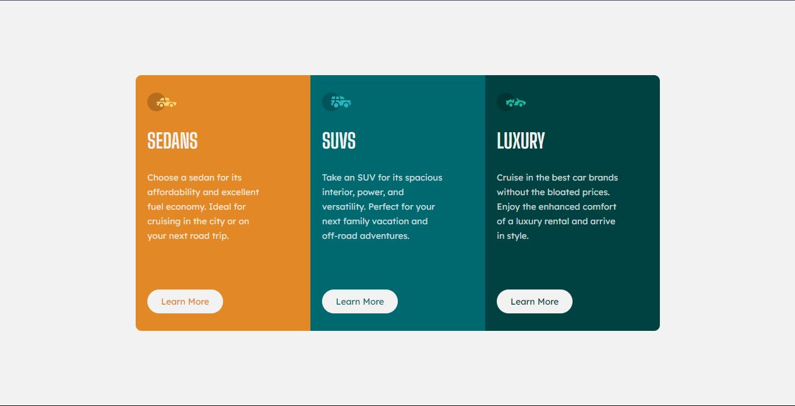

# Frontend Mentor - 3-column preview card component solution

### ✨ Sobre o projeto

Esta é uma solução para o desafio [3-column preview card component challenge on Frontend Mentor](https://www.frontendmentor.io/challenges/3column-preview-card-component-pH92eAR2-). Os desafios do Frontend Mentor ajudam você a melhorar suas habilidades de codificação criando projetos realistas.

### 🎯 O desafio

Os usuários devem ser capazes de:

- Veja o layout ideal dependendo do tamanho da tela do dispositivo
- Veja os estados de foco para elementos interativos

Como este projeto é voltado para estudos, foquei exclusivamente na responsividade para desktop e dispositivos móveis, seguindo os designs do projeto.

### 🔗 Links 

- [Solução no Frontend Mentor]()

- [Deployment no Github Pages]()

### ✨ Tecnologias Utilziadas

- Marcação semântica HTML5
- CSS
- Flexbox

### 📚 Aprendizado

Com esse desafio, aprimorei minhas habilidades com o Flexbox, centralização de elementos e criação de colunas, além de solidificar minha base com HTML.

### 🚀 Desenvolvimento contínuo

Para meus próximos projetos, planejo utilizar JavaScript como linguagem principal. Estou totalmente determinado a implementar essa linguagem em todos os meus projetos a partir de agora.

## 🙋 Autor

- Perfil no Linkedin - [Clique aqui.](https://www.linkedin.com/in/fransuelton/)
- Página no Frontend Mentor - [Clique aqui.](https://www.frontendmentor.io/profile/Fransuelton)